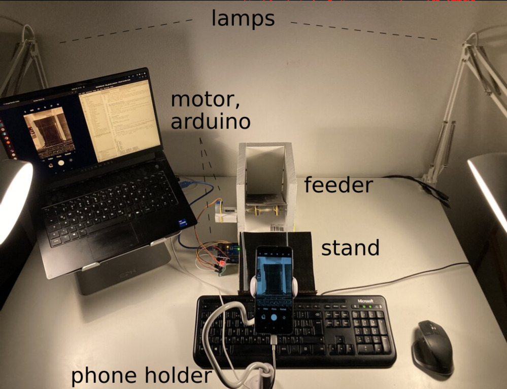

## Overview
This repo provides a manual for making a DIY photo scanner that I have used to scan over 500 family photos - see the [video of operation](docs/operation.mp4). Its key components are an Android phone for camera, a DIY feeder based on Arduino for flipping photos and a pc to coordinate the two.

Assuming you have an **Android phone** and a **pc** the total cost of remaining components is 50-100$ (**bold** highlights required equipment here and below). There are free apps available for scanning photos using a smartphone (e.g. [PhotoScan](https://ai.googleblog.com/2017/04/photoscan-taking-glare-free-pictures-of.html)) but these require manually intervention for each photo. In contrast, the present scanner allows to feed and forget a pile of photos.

## Manual
- [Prepare the photos](#preparation)
- Setup [hardware](#hardware-setup)
- Setup [software](#software-setup)
- Apply suggestions from [scanning quality checklist](#scanning-quality-checklist) for best results
- Go through [calibration procedure](#calibration)
- Start [scanning](#scanning)

## Preparation
Both the feeder and scanner (camera capturing the photos on the stand) work best with flat photos. Photos that were kept in an album or a pile should be good enough - otherwise please flatten them (keep under a heavy book for a few hours).

## Hardware setup

### Arduino
Is used to control the feeder motor. I used a cheap **stepper motor** (28BYJ-48, 5V) that was in the same kit as **Arduino** (Uno rev. 3). The [arduino folder](./dps/arduino/) contains code for that and the pc to communicate with it. Another motor would work equally well but you might need to adapt the wiring and the `.ino` code accordingly - luckily, my SO took care of that.

### Feeder

See the [construction video](docs/construction.mp4) for an overview. The feeder consists of **three perpendicular walls**. In the photo above they are made of wood pieces connected by shelf pins. Any suitable material would do (my 1st prototype was made of cardboard) and using Lego is another option. The important dimensions are the ones determining the position of the input photo pile. These are shown in the image below assuming you have standard 100x150 photos. These dimensions determine the balance of friction of the wheels on the outgoing photo and weight of the photos on top of it. Given values allow to feed photos one at a time though they did not require much optimising so there is some tolerance. It should be noted that most other feeders rely on two pairs of wheels unlike this simpler design.

The **shaft** was made of a metallic rod (5 mm diameter; unimportant) covered with tape to keep the wheels in place. Nuts and washers are added to keep the shaft in place and are fixated with tape too. The (caster) **wheels** are of 25 mm diameter - also not strict and worked equally well with 30 mm when during testing. The material of the wheels is equally unimportant - it's the **rubber bands** on top that provide the necessary friction. The **connector of shaft to motor** was made from an old pen. A **small shelf for the motor** was made of wood and was also attached using shelf pins. The latter proved especially convient for testing the feeder because I could remove the motor and rotate the shaft manually. The feeder design was inspired by [the great earlier design of play card scanner from theguymasamato](https://www.youtube.com/watch?v=w-Q13GIPESM).

### Stand
The collector **stand was made from cardboard** following one of the 'DIY book stand' tutorials readily available on the web. The **two transparent pieces of plastic** were are added to keep the photos falling from the feeder in place for capturing with the camera. They are positioned in the funnel like fashion with 100 mm separation at the bottom and 105 mm at the top. I used left over packaging plastics - the material is again not that important as most household plastics have uniform absorbtion spectra across the whole visible spectrum, i.e. they only make the photos dimmer. These walls do need to be high enough thought such that the shade from each of the two lamps (if you use them) covers the whole photo uniformly.

### Camera positioning
Is easiest done with a **phone holder**. Naturally, you would want to bring the camera as close as possible for the best resolution. Ideally, the camera axes are approximatedly aligned with the picture stand - not strictly needed as software rotates
the scanned photo.

## Software setup
### PC
My pc had Ubuntu 22.04 and the software in the repo relies on Python 3. To install it go to the repo root and do `pip install -e .` (inside a virtual environment).

### Android
The advantage of using Android (tested on Redmi running MIUI 12.5) is that it's camera app has 'pro' mode that allows manual control over camera settings (e.g. white balance, exposure, gain). To take photos I went down the quick and dirty route of installing [scrcpy](https://github.com/Genymobile/scrcpy) on pc and connecting Android via USB (you need to enable developer options and usb debug on the phone first). When that is done run `scrcpy --v4l2-sink=/dev/video0` (if that does not work try `export DISPLAY=":0"`). The end result is that Android screen will be visible on the pc and controllable with mouse.
After having that, change the *android_image_dir* and *capture_mouse_click_position* in `config.yaml` (here and below *italic* is used for configuration values)

### What if I don't have an Android phone
No problem at all -  you can set whatever phone or camera you have and start recording in video mode. Then set *motor_only: True* and proceed with scanning. After the scanning is complete transfer the video to your pc and use `get_images_from_video.py` script to extract individual frames. Once extracted you can process them with `dummy: True` setting which uses files from disc instead of actual camera capture. Note, that with this setup pc does not have to be connected to Arduino. The latter can be
activating the motor continuously rather than on command.

## Scanning quality checklist
There is a great talk by [Peter Krogh](https://www.youtube.com/watch?v=yxmFjvFLPu4) titled "Scanning photos with you camera" and the suggestions below are based on that:

- Use **two lamps** which allow to get uniform and constant lighting. Natural day light is an alternative but illumination change and the stand/camera holder needs changing to account for different reflection from top and bottom as well as glare if the light source lies behind the camera
- Use mirror to see camera is parellel to the base
- Measure light uniformity inside the capture area to account for possible culprits:
    - non-uniform illumination
    - sensor dust
    - refletions from the surroundings

## Calibration
### Determining scanned photo location in the scene
Given the stand structure determines the photo position, you can feed a single photo to the stand, capture it with `python dps/camera.py config.yaml` and record the corner locations by modifying *input_image_shape* and *mask_corners* inside `config.yaml`.

### White Balance, exposure and gain of the camera
For white balancing one needs a target. One cheap target for that can be [diy'ed using
teflon tape](https://photographylife.com/diy-reliable-and-cheap-universal-white-balance-reference-device). That target turns out to have high reflectance that is uniform across the visible spectrum. The bulletpoints below assume you have one placed within the camera field of view. Then considering only (!) pixels on the teflon target:
- change the white balance on the camera such that R, G, B are as equal as possible for the target
- lower the gain (ISO) as much as possible to have less noise in the captured images
- increase exposure until the pixels become just below 255 (saturation) - ideally 245 (the teflon target reflectivity is ~96%)
- Optionally, you can change *rgb_correction_factors* in `config.yaml` to  account for deviations from perfect white balance - see `dps/white_balance.py` for details

## Scanning
After all the above is done you are ready to go. Set the *how_many_scans* and optionally *output_shift*. Then start scanning by executing
`python dps/main.py config.yaml`. Throughout the scanning `scrcpy` needs to be running.

## Some ideas for improvement
- Feeder mechanism is not perfect but based on limited statistics can safely say that it feeds at least 9 out of 10 photos successfully, i.e. one at a time
- The very last photo of the pile doesn't get out of the feeder because there is nothing pressing on it - can put an extra one on top
- High quality camera; modern ones allow direct connection to pc - see [gphoto2](https://github.com/gphoto/gphoto2), [their list of supported cameras](http://www.gphoto.org/proj/libgphoto2/support.php), [and video tutorial](https://www.youtube.com/watch?v=1eAYxnSU2aw)
- Using RAW images provides higher quality as well as other benefits, e.g. allows correcting white balance after capture
- More accurate [calibrateion of camera using a color checker](https://www.baslerweb.com/en/vision-campus/camera-technology/color-calibration-of-cameras/)
- Less hacky way of integrating the camera. An alternative to USB connection for transferring photos are streaming apps but these send lower resolution compressed images and provide less control over camera settings. Then there are remote photoshoot apps but those do not provide APIs.
